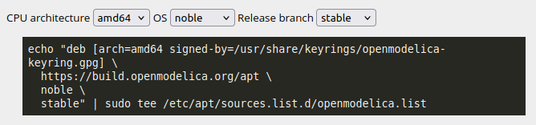

## OpenModelica en Linux
### Instalación en Linux
La instalación oficial se puede encontrar en el siguiente [Enlace](https://openmodelica.org/download/download-linux/).

Cómo muchas de las aplicaciones en los sistemas operativos #Linux su instalación se remite a solo unas líneas en la terminal de nuestra distribución, en este caso OpenModelica solo esta disponible para distribuciones como Debian, Ubuntu o extensiones de las mismas, siendo la versión de Ubuntu la que ha recibido mayor apoyo y seguimiento en sus versiones, si desea visualizar el [historial de commits](https://github.com/OpenModelica/OpenModelica/commits/v1.27.0) puede hacerlo en el enlace anterior, donde podrá visualizar la información del repositorio oficial de OpenModelica.
La instalación se remite a simplemente escribir los siguientes comandos para actualizar los paquetes y instalar la firma digital certificada para los paquetes oficiales de OpenModelica:
```bash
sudo apt-get update
sudo apt-get install ca-certificates curl gnupg
curl -fsSL https://build.openmodelica.org/apt/openmodelica.asc | \
  sudo gpg --dearmor -o /usr/share/keyrings/openmodelica-keyring.gpg
```
En este apartado será relevante conocer la arquitectura de su CPU, su OS (sistema operativo) y la rama de lanzamiento que desea utilizar, una vez tenga esta información puede llenar los siguientes atributos en la página de descargas de OpenModelica, se debería de visualizar un código similar al siguiente *(noté que es distinto dependieno de sus necesidades)*.
Comandos para Conocer la arquitectura de su CPU y el OS de su distribución:
```bash
sudo nano /etc/apt/sources.list # Arquitectura de CPU
cat /etc/os-release #OS
```
una vez que ingreso lo necesario visualizará un código similar al siguiente:

Luego puede instalar OpenModelica de la siguiente manera:
```bash
sudo apt update
sudo apt install openmodelica
```
Si desea instalar una versión con el mismo proposito pero evitando instalar gráficos, puede realizarlo con el siguiente comando, el cual obviara algunos paquetes, no cambiará el funcionamiento del software, simplemente instalara una versión *minimalista* del mismo.
```bash
sudo apt install --no-install-recommends omc
```
## Librerias en Modelica
Existe un gestor de paquetes para las librerias de Modelica construido en la secuencia de comandos y la interfaz gráfica del #OMEdit, si desea conocer más sobre ello, puede remitirse a la siguiente [documentación](https://openmodelica.org/doc/OpenModelicaUsersGuide/latest/packagemanager.html) para más detalles.
### Instalación Offline
para realizar el siguiente comando no es necesario utilizar internet, sin el mismo sigue siendo posible instalar la libreria estandar de Modelica.
```bash
sudo apt install omlibrary
```
Estás Librerías serán instaladas automaticamente por the gestor de paquetes en el directorio donde el usuario instaló OpenModelica, tan pronto como cualquier herramienta de OpenModelica intente carga cualquier librería del sistema por primera vez, un ejemplo puede ser OMEdit 