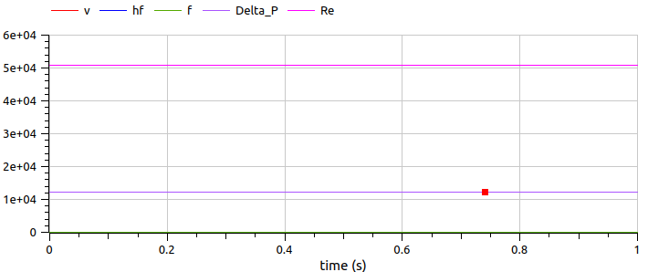

# Ejercicio 2
Por una tubería circular de 50 m de longitud y 0,05 m de diámetro interno circula agua a un caudal constante de 0,002 $m^3/s$. El agua tiene una densidad de 998 $kg/m^3$ y una viscosidad dinámica de $1,002x10^{-3} Pa\cdot s$. La rugosidad absoluta de la tubería es de 0,045 mm y considerando la aceleración de la gravedad de 9,81 $m/s^2$

Determine:

- La velocidad media del agua dentro de la tubería.
- El número de Reynolds del flujo y determine el régimen de circulación.
- El factor de fricción de Darcy-Weisbach, utilizando la ecuación explícita de Swamee-Jain.
- La pérdida de carga por fricción en la tubería.
- La diferencia de presión ($\Delta P$) asociada a dicha pérdida de carga.

# Implementación en Modelica

Similar al ejercicio en el código colocamos los datos que tenemos, y las variables que queremos calcular, igual al "[mass_balance](00B_examples/mass_balance/README.md)".

Colocamos de igual manera las ecuaciones, en este caso hay una diferencia y es en el como calculamos el factor de fricción (en este caso usamos la forma explícita de Swamee-Jain), la diferencia sustancial se encuentra en el análisis previo que llevamos a cabo, puesto que si calculamos el factor de fricción de otra forma puede que afecte el resultado.
## Código
```modelica
model Fluidos_Friccion
//Valores conocidos
parameter Real L = 50 "m";
parameter Real D = 0.05 "m";
parameter Real Q = 0.002 "m^3/s";
parameter Real E = 0.045e-3 "m";
parameter Real Rho = 998 "kg/m^3";
parameter Real Miu = 1.002e-3 "Pa*s";
parameter Real g = 9.81 "m/s^2";

//Valores Desconocidos
Real v;
Real Re;
Real f;
Real hf;
Real Delta_P;

equation
v = (4*Q)/(Modelica.Constants.pi*(D^2));
Re = (Rho*v*D)/Miu;
f = (0.25)/(log10((E/(3.7*D))+(5.74/Re^0.9)))^2;
hf = f*(L/D)*(v^2/(2*g));
Delta_P = Rho*g*hf;

annotation(
    Diagram);
end Fluidos_Friccion;
```
## Resultados
