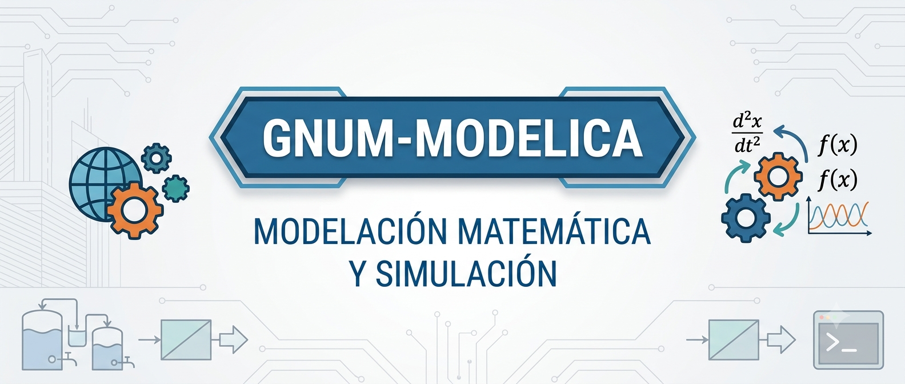
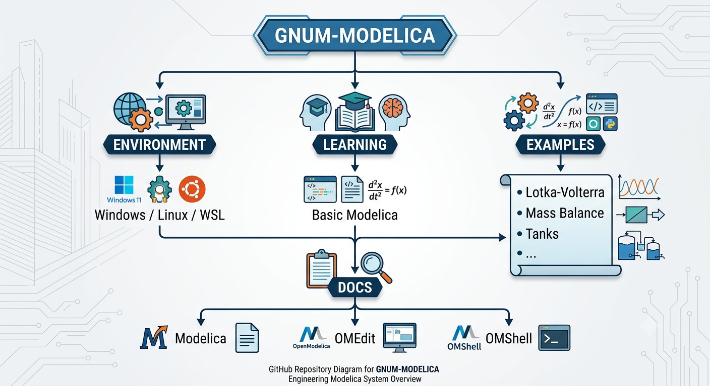

<p align="center">
  
</p>

# Tabla de Contenidos
- [¿Qué es GNUM-Modelica?](#qué-es-gnum-modelica)
- [¿Qué hace único a Modelica?](#qué-hace-único-a-modelica)
  - [Ejemplo: Modelo Masa Resorte Amortiguador](#ejemplo-modelo-masa-resorte-amortiguador)
  - [¿Qué significa la Acausalidad en Modelica?](#qué-significa-la-acausalidad-en-modelica)
  - [¿Puedo modelar algo que no sea mecánica?](#puedo-modelar-algo-que-no-sea-mecánica)
- [📁 Estructura del Repositorio](#estructura-del-repositorio)
- [OpenModelica](#openmodelica)
  - [Más allá de Modelica](#más-allá-de-modelica)


---

# ¿Qué es GNUM-Modelica?
La idea del presente repositorio busca responder una pregunta en concreto:
**Cómo puede ser usado Modelica como un lenguaje computacional para modelación matemática, simulación y experimentación númerica en Ingeniería**

Se busca que todo lo que se realice en este repositorio sea reproducible para el aprendizaje de los estudiantes en el Lenguaje de Modelica, pero más importante, en el razonamiento y comprensión del Lenguaje, limitaciones, casos de uso, ejemplos, proyectos o incluso como aplicarlo en las diversas áreas de la ingeniería.
# ¿Qué hace único a Modelica?
Más allá de la syntax de Modelica lo importante es resolver la pregunta de, *Qué se esconde detrás del Código*, qué fenomeno físico se busca explicar y desarrollar.

Una de las propiedades más interesantes de Modelica es su capacidad para trabajar con ecuaciones, en los lenguajes de programación comunes para resolver o tratar con una ecuación diferencial.

### Ejemplo: Modelo Masa Resorte Amortiguador
El siguiente modelo puede ser descrito por la ecuación diferencial.

$$m\ddot{x}+c\dot{x}+kx=F(x)$$


En lenguajes de programación imperativos podemos programar esto despejando la ecuación, definiendo la función, aplicando un solver y gráficando la solución númerica.

> **¿Qué pasaría si en lugar de decirle al computador cómo resolverlo, describiéramos directamente el sistema que queremos modelar?**

Modelica nos permite trabajar con las ecuaciones directamente, no necesitamos despejar ni definir que entra o que sale. No estamos programando únicamente un algoritmo para obtener $x(t)$. Estamos describiendo el sistema, teniendo la información de varios casos, no solo limitandonos a un valor de entrada y un valor de salida, ya que podemos modelar casos donde en el caso A, utilicemos la variable $\alpha$ para obtener la variable $\beta$, pero eso no nos limitaría a modelar el caso donde tenemos la variable $\beta$ y deseamos conseguir la variable $\alpha$.
```text
          MODELO MATEMÁTICO
                  │
                  ▼
       ┌────────────────────┐
       │ m x¨ + c x˙ + kx=F │
       └────────────────────┘
                  │
        ┌─────────┴─────────┐
        ▼                   ▼
    Enfoque causal      Enfoque Modelica
        │                   │
        ▼                   ▼
  ¿Cómo resolver?       ¿Cómo describir?
        │                   │
        ▼                   ▼
      Solver             Sistema
```

Aunque el proposito con el repositorio no es buscar un lenguaje que reemplace a Python o a Julia *(porque los 3 lenguajes no están ni cerca de haber sido creado con el mismo proposito)*, se busca encontrar una conexión entre las áreas que pueden abarcar los lenguajes previamente mencionados, una de las maneras en que se puede ejecutar esto, es utilizando Modelica como le software de **Modelado** y/o **Simulación** y Python o Julia se convierten en la capa de post-procesamiento, análisis o incluso optimización de nuestro modelo.
Este repositorio estudía Modelica desde dos ámbitos diferentes, Modelica como lenguaje y OpenModelica como software, es importante conocer el manejo y abstracción que utiliza el lenguaje, debido a que se rige por el principio de la programación orientada a objetos (POO), el software de OpenModelica busca sintetizar y abstraer la idea del lenguaje, sus clases, su herencia, el manejo de ecuaciones, librerías, componentes, bloques y utilizarlo en la simulación, donde ya ocurre el respectivo análisis, Optimización o incluso lo metodos númericos que se aplican.
### Qué significa la Acausalidad en Modelica?
[Realmente, ¿Qué es Modelica?](docs/modelica.md) 

Imagine que vamos a modelar una bomba de agua, en un lenguaje imperativo podemos modelar un sistema que con la presión nos devuelva un valor del caudal definido en nuestro contexto, pero si quisieramos ingresar un caudal y recibir una presión, deberíamos volver a programar el modelo, despejar ecuaciones y utilizar relaciones para llegar a una conclusión, con Modelica podemos definir un grupo de ecuaciones para todo un modelo, esto último facilita la reutilización del código.

### ¿Puedo modelar algo que no sea mecánica?
Una de las mayores ventajas de Modelica es que es un lenguaje de **Multi-dominio**, no hay una limitación en los casos que se pueden realizar distintas aplicaciones con el lenguaje, no solo en áreas especificar, sino también en sistemas se pueden varios sistemas físicos al tiempo, algunas de las infinitas aplicaciones que tiene el lenguaje se ver en los siguientes ejemplos.


| Ejemplo | Área | Qué demuestra |
| :--- | :--- | :--- |
| **Masa-resorte** | Mecánica | Componentes físicos |
| **Balance de materia** | Ingeniería química | Conservación |
| **Tanques** | Fluidos | Dinámica |
| **Lotka–Volterra** | Biología | EDO / sistemas dinámicos |
| **Motor** | Control/electromecánica | Multidominio |
| **Línea de producción** | Industrial | Sistemas |
| **Modelo con incertidumbre** | Estadística | Experimentación |
| **Optimización de parámetros** | Computación | Integración externa |


El siguiente enlace permite visualizar alguno de estos [ejemplos](00B_examples).

---
#  Estructura del Repositorio

A continuación se presenta un mapa general de los componentes y módulos que integran este repositorio:

<p align="center">
  
</p>

# OpenModelica
En el siguiente [Enlace](https://openmodelica.org/) puede encontrar la página oficial de OpenModelica, puede encontrar la lista de herramientas proporcionadas por OpenModelica en la misma página, para ello debe dirigirse al apartado  Users -> Tools, donde puede encontrar las siguientes herramientas:
- **Advanced Interactive OpenModelica Compiler (OMC):** Trae un compilador que convierte el código Fuente (Modelica) a código #C para la respectiva simulación.
- **Interactive OpenModelica Shell** Interfaz interactiva de comandos, escribes una orden o expresión, presionas Enter, el sistema la procesa al instante y te devuelve una respuesta en la línea siguiente. Similar a la terminal de comando de #Python, esto se debe a que Modelica es un lenguaje interpretado.
- **OpenModelica Notebook (OMNotebook)**: Libro de texto mediante ejercicios del lenguaje Modelica, similar a los cuadernillos de Notebook.
- **OMEdit:** Programa principal donde realizaremos los modelos y donde se va a programar en Modelica.
- **OMEdit Integrated with Electronic Notebooks and Interactive Simulation:** OMEdit para simulación iterativa, para formación.
- **OMPython:** Permite utilizar el lenguaje de Modelica en el entorno de Python, util para evitar exportar datos.
El resto de herramientas se iran estudiando en el transcurso del tiempo, pero estás son las más relevantes.

Para conocer como instalar OpenModelica según su sistema operativo, puede remitirse al siguiente [enlace](docs/installation.md)
## Más allá de Modelica

Modelica no pretende reemplazar Python.

La pregunta que exploramos es:
>¿Cómo pueden complementarse?